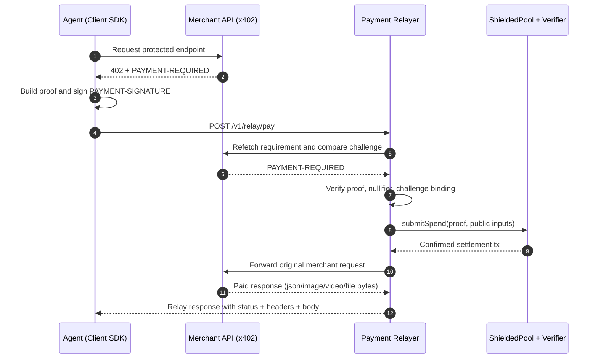

# Shielded x402

Monorepo for a privacy-preserving payment rail built with Noir + x402 + Solidity.

## Repository layout

- `/shielded-402/contracts` - Shielded pool contracts and Foundry tests.
- `/shielded-402/circuits/spend_change` - Noir circuit for spend + change.
- `/shielded-402/sdk/client` - Client payment SDK and note encryption.
- `/shielded-402/sdk/merchant` - Merchant challenge/verification + withdrawal signing.
- `/shielded-402/services/merchant-gateway` - Express middleware/service.
- `/shielded-402/services/payment-relayer` - Relayer that verifies agent-generated proofs, settles onchain, and executes merchant payout adapter.
- `/shielded-402/packages/shared-types` - Shared payload and crypto constants.
- `/shielded-402/packages/erc8004-adapter` - Feature-flagged ERC-8004 adapter.
- `/shielded-402/examples/demo-api` - End-to-end demo client.
- `/shielded-402/examples/payai-echo-fetch` - Standard commercial x402 example against PayAI endpoint.
- `/shielded-402/examples/payai-shielded-relay` - Shielded-to-relayer flow that pays PayAI via x402 payout mode.

## Quickstart

1. Install dependencies: `pnpm install`
2. Install Foundry libs (Solady): `pnpm contracts:deps`
3. Validate tooling: `pnpm doctor`
4. Build all packages: `pnpm build`
5. Run tests: `pnpm test`
6. Run contract tests: `pnpm contracts:test`

## Noir workflow

- Check circuit: `pnpm circuit:check`
- Generate verifier artifact: `pnpm circuit:verifier`
- Generate payment fixture from proof outputs: `pnpm circuit:fixture`

## Demo flow

1. Start relayer: `pnpm relayer:dev`
2. Start merchant endpoint (existing x402-compatible merchant or local gateway): `pnpm --filter @shielded-x402/merchant-gateway dev`
3. Run client demo: `pnpm --filter @shielded-x402/demo-api demo`

## Agent Plug-and-Play (NoirJS)

- For in-process proof generation in agents, configure client SDK with `proofProvider` via `createNoirJsProofProviderFromDefaultCircuit()`.
- For a single-call integration, use `createShieldedFetch(...)` and replace direct `fetch` calls.
- See `shielded-402/docs/sdk.md` for setup snippet.

## Agent Prerequisite (Deposit First)

- Agent must first deposit into `ShieldedPool` and hold a spendable shielded note.
- Agent must maintain note + Merkle witness state (via local indexer/state store).
- No deposit/note state means payment proof cannot be settled onchain.

## High-Level Flow

## Sepolia deployment

1. Copy env file: `cp .env.example .env`
2. Set `SEPOLIA_RPC_URL`, `DEPLOYER_PRIVATE_KEY`, `USDC_ADDRESS`
3. Generate verifier: `pnpm circuit:verifier`
4. Deploy verifier + adapter + pool: `pnpm deploy:sepolia`
5. Set relayer env: `RELAYER_RPC_URL`, `SHIELDED_POOL_ADDRESS`, `ULTRA_VERIFIER_ADDRESS`, `RELAYER_PRIVATE_KEY`
6. Start relayer: `pnpm relayer:dev`

## Live integration test

- Ensure gateway runs with Sepolia verifier/pool env values.
- Provide valid proof fixture JSON in `E2E_PAYMENT_RESPONSE_FILE`.
- Set `FIXED_CHALLENGE_NONCE` to the nonce used to generate that proof fixture.
- Run: `pnpm test:sepolia-live`

## Local Anvil dummy stack

- Start Anvil: `anvil --chain-id 31337`
- Deploy local stack: `pnpm deploy:anvil:dummy`
- This deploys `MockUSDC`, `MockProofVerifier`, `ShieldedPool`, `DummyShieldedService`.
- One-command local smoke test: `pnpm e2e:anvil`

## Agent integration

- Agent integration/testing guide: `/shielded-402/docs/agents-guide.md`
- Full testing playbook (Anvil + Sepolia): `/shielded-402/docs/testing-playbook.md`
- Relayer internals and safeguards: `/shielded-402/docs/relayer-architecture.md`

## npm distribution

- Publish checklist and commands: `shielded-402/docs/publish-npm.md`
