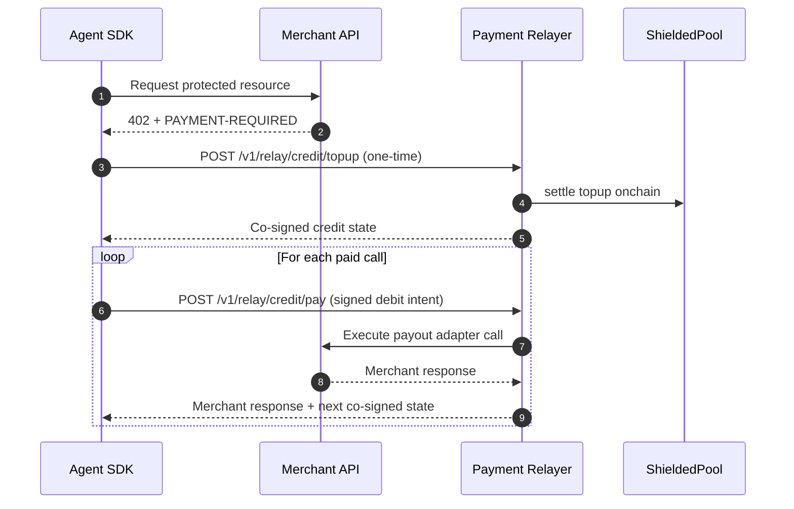
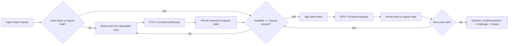

# Shielded x402

Privacy-preserving x402 payments with a shielded spend circuit, relayer settlement, and a fast credit channel mode.

## What you get

- Shielded spend/change flow (`shielded-usdc` rail)
- Relayer path for merchant-unchanged integrations
- Credit channel path: one proof-backed topup, then signature-only debits
- SDKs for clients and merchant integrations

## Repo layout

- `contracts/` Solidity contracts and Foundry tests
- `circuits/spend_change/` Noir circuit
- `sdk/client/` Client SDK (`ShieldedClientSDK`, credit client/fetch, wallet state)
- `sdk/merchant/` Merchant-side utilities
- `services/payment-relayer/` Relayer APIs (credit routes)
- `services/merchant-gateway/` x402 gateway service
- `packages/shared-types/` Shared protocol/types
- `packages/erc8004-adapter/` ERC-8004 discovery adapter
- `examples/` runnable flows

## Quick start

```bash
pnpm install
pnpm contracts:deps
pnpm build
pnpm typecheck
pnpm contracts:test
```

## Security Defaults

- Payment relayer is fail-closed by default.
- Missing onchain verifier/settlement config will fail startup.
- Use `RELAYER_UNSAFE_DEV_MODE=true` only for local insecure testing.

## Main flow

1. Agent tops up credit once via a shielded proof (`/v1/relay/credit/topup`).
2. Agent stores the latest co-signed channel state.
3. Every x402 call uses signature-only debit intents (`/v1/relay/credit/pay`).
4. Agent persists the returned next co-signed state.

## Flow diagram



## Credit lifecycle diagram



## Docs

- SDK usage: `docs/sdk.md`
- Agent integration: `docs/agents-guide.md`
- Relayer architecture: `docs/relayer-architecture.md`
- System architecture: `docs/architecture.md`
- Testing playbook: `docs/testing-playbook.md`

## Examples

- A2A credit flow: `examples/agent-to-agent-relayed/`
- PayAI credit flow: `examples/payai-shielded-relay/`
