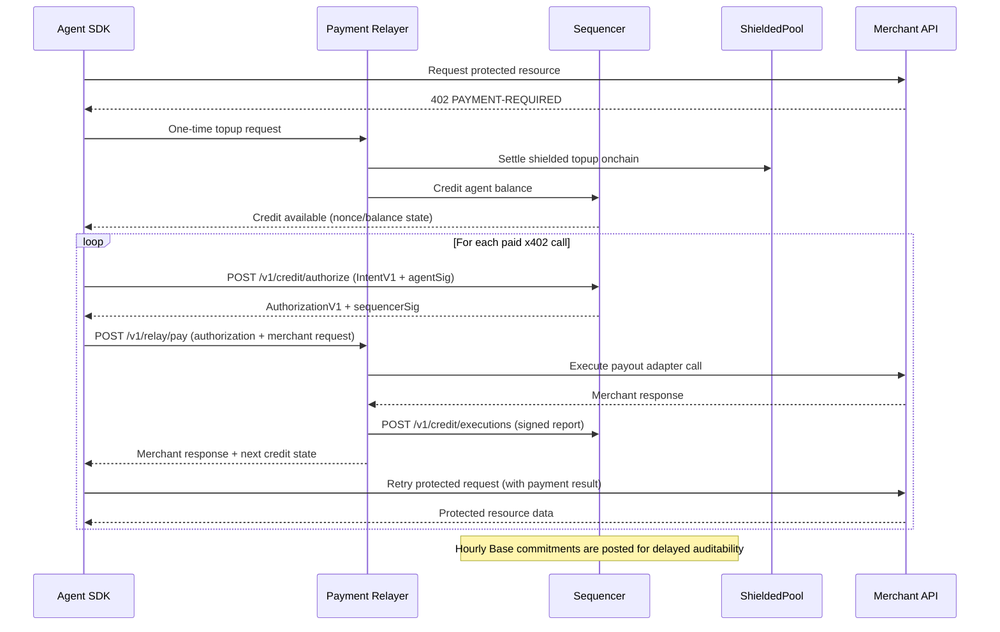

# Shielded x402

Breaking multi-chain credit MVP with:

1. one authoritative sequencer for real-time nonce/balance enforcement
2. per-chain relayers (`Base`, `Solana`) that execute only sequencer-authorized payments
3. periodic Base commitment roots for delayed independent auditability
4. shielded onchain settlement as the funding source for credit balances

No backward compatibility is retained for legacy `/v1/relay/credit/*` flows.

## Flow Overview



Detailed architecture diagram: [docs/multi-chain-credit-mvp.md](/Users/nhestrompia/Projects/shielded-402/docs/multi-chain-credit-mvp.md)

### Funding path

1. **Required architecture path:** shielded settlement output (`FundingSignal`) credits sequencer balances without exposing user payment graph.
2. **Local test shortcut only:** `POST /v1/admin/credit` exists only to seed balances in dev/test environments.

## Repo layout

- `contracts/` Solidity contracts and Foundry tests
- `chains/base/` Base EVM relayer adapter
- `chains/solana/` Solana Noir+Sunspot integration, native gateway program, relayer adapter, deploy/init scripts
- `circuits/spend_change/` Noir circuit
- `sdk/client/` Client SDK (`ShieldedClientSDK`, `MultiChainCreditClient`)
- `sdk/merchant/` Merchant-side utilities
- `services/credit-sequencer/` Sequencer APIs + commitment epoch builder
- `services/payment-relayer/` Per-chain relayer (`/v1/relay/pay`)
- `services/merchant-gateway/` x402 gateway service
- `packages/shared-types/` Shared protocol/types
- `packages/erc8004-adapter/` ERC-8004 discovery adapter
- `examples/` runnable flows

## Quick start

```bash
pnpm install
pnpm contracts:deps
pnpm build
pnpm typecheck
pnpm contracts:test --match-path test/CommitmentRegistryV1.t.sol

# start local sequencer + base relayer + solana relayer
pnpm dev:stack:start

# run dual-chain example (base noop + solana onchain by default)
pnpm example:multi-chain:base-solana
```

To stop services:

```bash
pnpm dev:stack:stop
```

To run real Base onchain settlement in the example, run Base relayer in `RELAYER_BASE_PAYOUT_MODE=evm` and set:

1. `RELAYER_EVM_PRIVATE_KEY`
2. `BASE_ONCHAIN=true`
3. `BASE_RPC_URL`
4. `BASE_RECIPIENT_ADDRESS`
5. `BASE_CHAIN_ID` and `BASE_CHAIN_REF`

## SDK examples

The SDK surface has two rails:

1. `ShieldedClientSDK`: anonymous proof-backed x402 payment payload construction.
2. `MultiChainCreditClient`: sequencer-authorized fast execution across chain-specific relayers.

### Plug-and-play integration modes

1. **Direct x402 header mode (merchant-facing):**
Use `createShieldedFetch(...)`. The SDK receives `402 PAYMENT-REQUIRED`, builds `PAYMENT-SIGNATURE`, retries, and gets protected data directly from merchant.

2. **Relayer-executed mode (agent-facing):**
Use `MultiChainCreditClient` + relayer `POST /v1/relay/pay`. The relayer executes payment on behalf of agent, calls merchant, and returns merchant result to agent.

In short: headers are for direct x402 compatibility; relayer mode is pay-and-proxy execution.

### 1) Anonymous x402 call (`createShieldedFetch`)

You do not manually construct `PaymentRequirement` in normal usage.  
The merchant returns it in `402 PAYMENT-REQUIRED`, and `createShieldedFetch` handles the retry.

```ts
import {
  ShieldedClientSDK,
  LocalNoteIndexer,
  buildWitnessFromCommitments,
  createShieldedFetch
} from '@shielded-x402/client';

const sdk = new ShieldedClientSDK({
  endpoint: RELAYER_URL,
  signer: async (message) => account.signMessage({ message })
  // proofProvider: optional, if you want real Noir/bb proofs in client-side flow
});

// agent-local persistence (wallet/db). Keep notes + nullifier secrets here.
const noteStore = new LocalNoteIndexer();
const nullifierSecretsByCommitment = new Map<string, `0x${string}`>();

const shieldedFetch = createShieldedFetch({
  sdk,
  resolveContext: async () => {
    const note = noteStore.getNotes().find((n) => n.amount > 0n);
    if (!note) throw new Error('no spendable shielded note');

    const commitments = noteStore.getCommitments();
    const witness = buildWitnessFromCommitments(commitments, note.leafIndex);
    const nullifierSecret = nullifierSecretsByCommitment.get(note.commitment);
    if (!nullifierSecret) throw new Error('missing nullifier secret for selected note');

    return { note, witness, nullifierSecret };
  }
});

// 1) GET -> merchant returns 402
// 2) SDK auto-builds PAYMENT-SIGNATURE
// 3) retries request
// 4) returns protected data on success
const res = await shieldedFetch('https://api.example.com/paid/data');
console.log(await res.text());
```

Notes and nullifier secrets are agent-local state (wallet/db), not relayer/sequencer state.

If you need low-level control, you can still call `prepare402Payment(...)` directly.

### 2) Authorize + relay pay (fast credit path)

```ts
import { MultiChainCreditClient } from '@shielded-x402/client';
import { normalizeHex } from '@shielded-x402/shared-types';
import { createHash, sign, createPrivateKey } from 'node:crypto';

const client = new MultiChainCreditClient({
  sequencerUrl: 'http://127.0.0.1:3200',
  relayerUrls: {
    'eip155:8453': 'http://127.0.0.1:3100',
    'solana:devnet': 'http://127.0.0.1:3101'
  },
  sequencerAdminToken: 'change-me'
});

// from your wallet / local agent state:
const agentId = '0x<agent-id>';
const agentPubKey = '0x<agent-pubkey>';
const agentNonce = '0';
const agentPrivateKeyPem = process.env.AGENT_ED25519_PRIVATE_KEY_PEM!;

const result = await client.pay({
  chainRef: 'eip155:8453',
  amountMicros: '1500000',
  merchant: {
    serviceRegistryId: 'demo/base',
    endpointUrl: 'https://merchant.base.example/pay'
  },
  merchantRequest: {
    url: 'https://merchant.base.example/pay',
    method: 'POST',
    headers: { 'content-type': 'application/json' },
    bodyBase64: Buffer.from(JSON.stringify({ orderId: 'o-123' })).toString('base64')
  },
  agent: {
    agentId,
    agentPubKey,
    signatureScheme: 'ed25519-sha256-v1',
    agentNonce,
    signIntent: async ({ canonicalBytes }) => {
      const digest = createHash('sha256').update(canonicalBytes).digest();
      const privateKey = createPrivateKey(agentPrivateKeyPem);
      return normalizeHex(`0x${sign(null, digest, privateKey).toString('hex')}`);
    }
  }
});

console.log(result.relay.executionTxHash, result.relay.status);
```

### 3) Fetch commitment proof and reclaim (if expired)

```ts
import { MultiChainCreditClient } from '@shielded-x402/client';

const client = new MultiChainCreditClient({
  sequencerUrl: 'http://127.0.0.1:3200',
  relayerUrls: {
    'eip155:8453': 'http://127.0.0.1:3100',
    'solana:devnet': 'http://127.0.0.1:3101'
  },
  sequencerAdminToken: 'change-me'
});

const latest = await client.latestCommitment();
console.log('latest epoch', latest.latestEpochId, 'root', latest.root);

const proof = await client.commitmentProof('0x<authId>');
console.log('proof epoch', proof.epochId, 'leaf', proof.leafHash);

await client.reclaim({
  authId: '0x<expired-authId>',
  callerType: 'sequencer',
  requestedAt: String(Math.floor(Date.now() / 1000))
});
```

## MVP API surface

Sequencer:

- `POST /v1/admin/credit`
- `POST /v1/credit/authorize`
- `POST /v1/credit/executions`
- `POST /v1/credit/reclaim`
- `GET /v1/commitments/latest`
- `GET /v1/commitments/proof`

Relayer (per chain):

- `POST /v1/relay/pay`

## Protocol locks

- canonical domain tags:
  - `x402:intent:v1`
  - `x402:authorization:v1`
  - `x402:authleaf:v1`
  - `x402:execution-report:v1`
- `sequencer_key_id` included in authorization and commitment metadata
- strict status machine:
  - `ISSUED -> EXECUTED`
  - `ISSUED -> RECLAIMED`
- invariant:
  - accepted nonces are strictly increasing per agent
  - accepted debits never exceed credited balance

## Docs

- `services/credit-sequencer/README.md`
- `services/payment-relayer/README.md`
- `docs/multi-chain-credit-mvp.md`
- `docs/architecture.md`
- `docs/testing-playbook.md`

## Examples

- `examples/multi-chain-base-solana/` end-to-end dual-relayer payment flow
