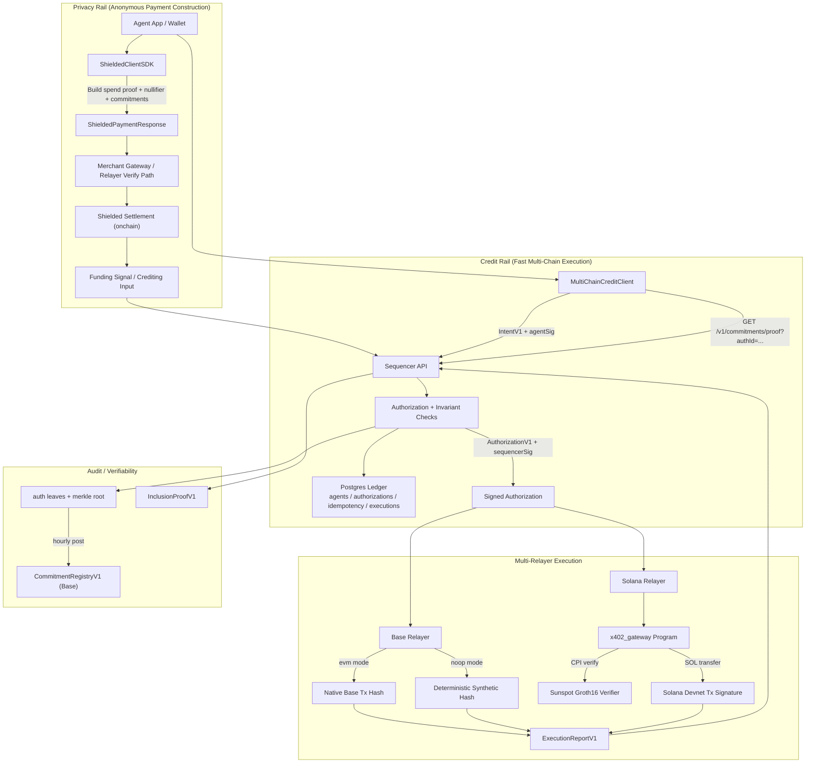

# Shielded x402

Breaking multi-chain credit MVP with:

1. one authoritative sequencer for real-time nonce/balance enforcement
2. per-chain relayers (`Base`, `Solana`) that execute only sequencer-authorized payments
3. periodic Base commitment roots for delayed independent auditability

No backward compatibility is retained for legacy `/v1/relay/credit/*` flows.

## End-to-End Flow (Full Picture)



### Funding modes

1. **Current test/dev mode:** sequencer credit is seeded via `POST /v1/admin/credit`.
2. **Target production mode:** shielded settlement output (`FundingSignal`) credits sequencer balances without exposing user payment graph.

## Repo layout

- `contracts/` Solidity contracts and Foundry tests
- `chains/base/` Base EVM relayer adapter
- `chains/solana/` Solana Noir+Sunspot integration, native gateway program, relayer adapter, deploy/init scripts
- `circuits/spend_change/` Noir circuit
- `sdk/client/` Client SDK (`ShieldedClientSDK`, `MultiChainCreditClient`)
- `sdk/merchant/` Merchant-side utilities
- `services/credit-sequencer/` Sequencer APIs + commitment epoch builder
- `services/payment-relayer/` Per-chain relayer (`/v1/relay/pay`)
- `services/merchant-gateway/` x402 gateway service
- `packages/shared-types/` Shared protocol/types
- `packages/erc8004-adapter/` ERC-8004 discovery adapter
- `examples/` runnable flows

## Quick start

```bash
pnpm install
pnpm contracts:deps
pnpm build
pnpm typecheck
pnpm contracts:test --match-path test/CommitmentRegistryV1.t.sol

# start local sequencer + base relayer + solana relayer
pnpm dev:stack:start

# run dual-chain example (base noop + solana onchain by default)
pnpm example:multi-chain:base-solana
```

To stop services:

```bash
pnpm dev:stack:stop
```

To run real Base onchain settlement in the example, run Base relayer in `RELAYER_BASE_PAYOUT_MODE=evm` and set:

1. `RELAYER_EVM_PRIVATE_KEY`
2. `BASE_ONCHAIN=true`
3. `BASE_RPC_URL`
4. `BASE_RECIPIENT_ADDRESS`
5. `BASE_CHAIN_ID` and `BASE_CHAIN_REF`

## SDK examples

The SDK surface has two rails:

1. `ShieldedClientSDK`: anonymous proof-backed x402 payment payload construction.
2. `MultiChainCreditClient`: sequencer-authorized fast execution across chain-specific relayers.

### 1) Anonymous shielded payment payload (`ShieldedClientSDK`)

```ts
import { ShieldedClientSDK, buildWitnessFromCommitments } from '@shielded-x402/client';
import type { Hex, PaymentRequirement, ShieldedNote } from '@shielded-x402/shared-types';

const sdk = new ShieldedClientSDK({
  endpoint: 'https://merchant.example/x402',
  signer: async (message) => {
    // wallet signature function
    return '0x...';
  }
});

const note: ShieldedNote = {
  amount: 2_000_000n,
  rho: '0x...',
  pkHash: '0x...',
  commitment: '0x...',
  leafIndex: 3
};

const requirement: PaymentRequirement = {
  scheme: 'exact',
  network: 'base-sepolia',
  asset: '0x...',
  payTo: '0x...',
  rail: 'shielded-usdc',
  amount: '1500000',
  challengeNonce: '0x...',
  challengeExpiry: String(Math.floor(Date.now() / 1000) + 300),
  merchantPubKey: '0x...',
  verifyingContract: '0x...'
};

const commitments: Hex[] = ['0x...', '0x...', note.commitment, '0x...'];
const witness = buildWitnessFromCommitments(commitments, note.leafIndex);

const prepared = await sdk.prepare402Payment(requirement, note, witness, '0x...');

// send protected request with x402 payment signature header
await fetch('https://merchant.example/protected', {
  method: 'POST',
  headers: prepared.headers,
  body: JSON.stringify({ action: 'purchase' })
});

console.log(prepared.response.nullifier, prepared.changeNote.commitment);
```

In this MVP, sequencer credit in local tests is typically seeded with `adminCredit`.
Production wiring should connect verified shielded settlement output to sequencer crediting.

### 2) Authorize + relay pay (fast credit path)

```ts
import {
  canonicalIntentBytes,
  deriveAgentIdFromPubKey,
  deriveMerchantId,
  normalizeHex,
  type AuthorizeRequestV1,
  type IntentV1
} from '@shielded-x402/shared-types';
import { MultiChainCreditClient } from '@shielded-x402/client';
import { createHash, generateKeyPairSync, randomBytes, sign, type KeyObject } from 'node:crypto';

function spkiEd25519ToHex(spkiDer: Buffer): `0x${string}` {
  const prefix = Buffer.from('302a300506032b6570032100', 'hex');
  const raw = spkiDer.subarray(prefix.length);
  return normalizeHex(`0x${raw.toString('hex')}`);
}

function signIntent(intent: IntentV1, privateKey: KeyObject): `0x${string}` {
  const digest = createHash('sha256').update(canonicalIntentBytes(intent)).digest();
  return normalizeHex(`0x${sign(null, digest, privateKey).toString('hex')}`);
}

const client = new MultiChainCreditClient({
  sequencerUrl: 'http://127.0.0.1:3200',
  relayerUrls: {
    'eip155:8453': 'http://127.0.0.1:3100',
    'solana:devnet': 'http://127.0.0.1:3101'
  },
  sequencerAdminToken: 'change-me'
});

const { publicKey, privateKey } = generateKeyPairSync('ed25519');
const agentPubKey = spkiEd25519ToHex(publicKey.export({ format: 'der', type: 'spki' }) as Buffer);
const agentId = deriveAgentIdFromPubKey(agentPubKey);
const merchantId = deriveMerchantId({
  serviceRegistryId: 'demo/base',
  endpointUrl: 'https://merchant.base.example/pay'
});

await client.adminCredit({ agentId, amountMicros: '5000000' }); // testnet/admin path

const intent: IntentV1 = {
  version: 1,
  agentId,
  agentPubKey,
  signatureScheme: 'ed25519-sha256-v1',
  agentNonce: '0',
  amountMicros: '1500000',
  merchantId,
  requiredChainRef: 'eip155:8453',
  expiresAt: String(Math.floor(Date.now() / 1000) + 300),
  requestId: normalizeHex(`0x${randomBytes(32).toString('hex')}`)
};

const authorizeReq: AuthorizeRequestV1 = {
  intent,
  agentSig: signIntent(intent, privateKey)
};

const { authorization, sequencerSig } = await client.authorize(authorizeReq);

const relayResult = await client.relayPay({
  authorization,
  sequencerSig,
  merchantRequest: {
    url: 'https://merchant.base.example/pay',
    method: 'POST',
    headers: { 'content-type': 'application/json' },
    bodyBase64: Buffer.from(JSON.stringify({ orderId: 'o-123' })).toString('base64')
  }
});

console.log(relayResult.executionTxHash, relayResult.status);
```

### 3) Fetch commitment proof and reclaim (if expired)

```ts
import { MultiChainCreditClient } from '@shielded-x402/client';

const client = new MultiChainCreditClient({
  sequencerUrl: 'http://127.0.0.1:3200',
  relayerUrls: {
    'eip155:8453': 'http://127.0.0.1:3100',
    'solana:devnet': 'http://127.0.0.1:3101'
  },
  sequencerAdminToken: 'change-me'
});

const latest = await client.latestCommitment();
console.log('latest epoch', latest.latestEpochId, 'root', latest.root);

const proof = await client.commitmentProof('0x<authId>');
console.log('proof epoch', proof.epochId, 'leaf', proof.leafHash);

await client.reclaim({
  authId: '0x<expired-authId>',
  callerType: 'sequencer',
  requestedAt: String(Math.floor(Date.now() / 1000))
});
```

## MVP API surface

Sequencer:

- `POST /v1/admin/credit`
- `POST /v1/credit/authorize`
- `POST /v1/credit/executions`
- `POST /v1/credit/reclaim`
- `GET /v1/commitments/latest`
- `GET /v1/commitments/proof`

Relayer (per chain):

- `POST /v1/relay/pay`

## Protocol locks

- canonical domain tags:
  - `x402:intent:v1`
  - `x402:authorization:v1`
  - `x402:authleaf:v1`
  - `x402:execution-report:v1`
- `sequencer_key_id` included in authorization and commitment metadata
- strict status machine:
  - `ISSUED -> EXECUTED`
  - `ISSUED -> RECLAIMED`
- invariant:
  - accepted nonces are strictly increasing per agent
  - accepted debits never exceed credited balance

## Docs

- `services/credit-sequencer/README.md`
- `services/payment-relayer/README.md`
- `docs/multi-chain-credit-mvp.md`
- `docs/architecture.md`
- `docs/testing-playbook.md`

## Examples

- `examples/multi-chain-base-solana/` end-to-end dual-relayer payment flow
