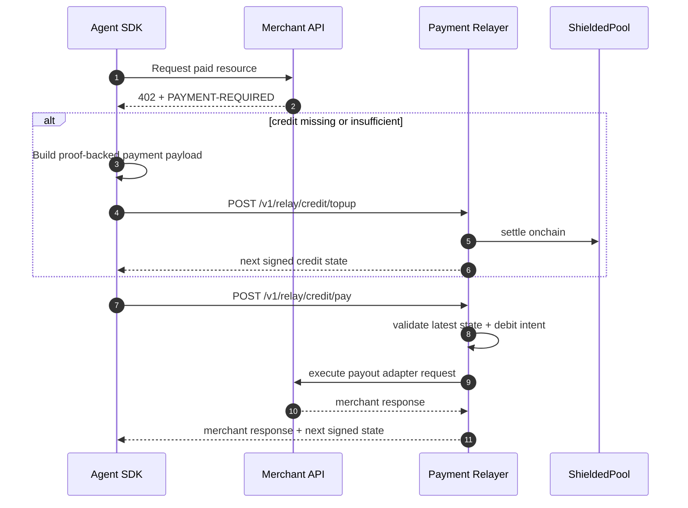

# Shielded x402 Architecture

## Components

- `contracts/`: `ShieldedPool`, verifier adapters, `CreditChannelSettlement`.
- `circuits/spend_change/`: Noir spend/change circuit.
- `sdk/client/`: proof payload building, credit client/fetch, wallet state, A2A routing.
- `sdk/merchant/`: challenge issuance + payload verification utilities.
- `services/payment-relayer/`: credit topup/pay/close APIs + payout adapters.
- `packages/shared-types/`: canonical types, hashes, route constants.
- `packages/erc8004-adapter/`: discovery providers and canonical profile normalization.

## Primary Flow (Credit Lane)

1. Merchant returns `402` with `PAYMENT-REQUIRED`.
2. Agent ensures channel has credit:
   - if missing/insufficient: proof-backed topup via `/v1/relay/credit/topup`.
3. Agent sends signed debit intent via `/v1/relay/credit/pay`.
4. Relayer validates state/debit, executes payout adapter call, and returns next signed state.
5. Agent persists next signed state.

## Safety Controls

- sequential channel rule (`nextSeq = currentSeq + 1`)
- debit intent binds to `merchantRequestHash`
- per-channel relayer lock + head compare-and-swap
- persisted head store for restart safety
- mandatory `requestId` for idempotency

## Close / Dispute Path

When enabled (`CREDIT_SETTLEMENT_CONTRACT`):

- `POST /v1/relay/credit/close/start`
- `POST /v1/relay/credit/close/challenge`
- `POST /v1/relay/credit/close/finalize`
- `GET /v1/relay/credit/close/:channelId`

## Discovery Boundary

- ERC-8004 discovery runs in SDK (endpoint selection only).
- Settlement correctness remains cryptographic and relayer/onchain enforced.

## Sequence

