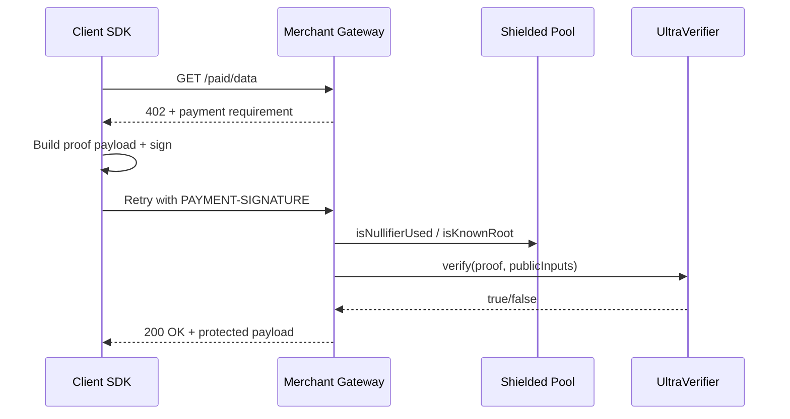
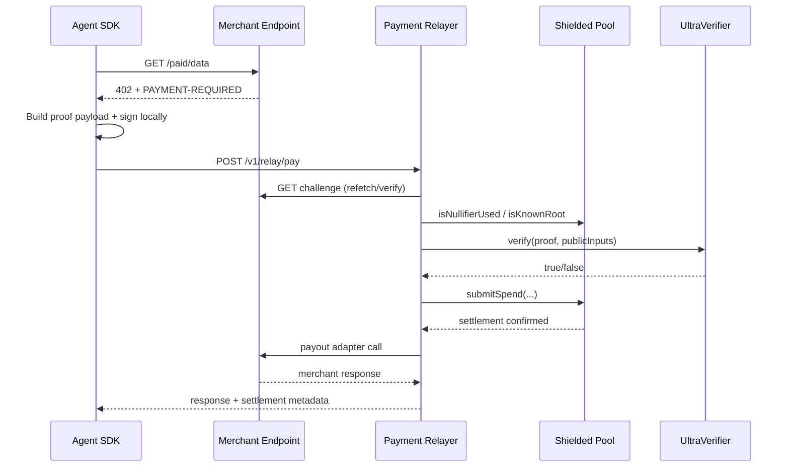

# Shielded x402 Architecture (MVP)

## Components

- `contracts/`: Shielded pool, verifier adapter interfaces, Solady-based safe ERC20 transfer handling.
- `circuits/spend_change/`: Noir circuit scaffold for single-note spend + change.
- `sdk/client/`: Deposit/proof payload generation, x402 retry client, note encryption.
- `sdk/merchant/`: Challenge issuing, payment verification, settlement records, withdrawal signing.
- `services/merchant-gateway/`: Express middleware enforcing shielded x402 payment.
- `services/payment-relayer/`: Verifies agent-generated proof bundles, settles onchain, and runs payout adapters for merchant-unchanged deployments.
- `packages/shared-types/`: Canonical crypto constants and payload schemas.
- `packages/erc8004-adapter/`: ERC-8004 directory client + provider model (onchain canonical identity + optional indexer enrichment).
- `sdk/client/src/agentPaymentFetch.ts`: High-level A2A wrapper (`url` or `erc8004` target).

## Discovery/trust boundary

- Discovery and counterparty policy run in the SDK.
- Settlement, nullifier/root checks, and payout execution run in the relayer.
- Cryptographic validity remains enforced onchain by pool/verifier contracts.
- Relayer does not apply trust gating to counterparties.

## HTTP flow

1. Client calls paid endpoint without payment headers.
2. Merchant middleware returns `402` + `PAYMENT-REQUIRED` (base64 x402 v2 envelope).
3. Client builds shielded payment payload and signs it.
4. Client retries with `PAYMENT-SIGNATURE` (base64 signed payment envelope).
5. Merchant validates nonce freshness, signature, and onchain proof/nullifier checks, then serves data.

## Feature flags

- `ENABLE_ERC8004=true` enables ERC-8004 adapter lookup endpoint behavior.
- `FIXED_CHALLENGE_NONCE` allows deterministic challenge issuance for live fixture-based E2E.

## Sequence (direct gateway mode)

## Sequence (relayer mode, merchant unchanged)

## Relayer mode (merchant unchanged)

1. Agent requests merchant endpoint and gets standard `402` challenge.
2. Agent locally generates shielded proof + signature.
3. Agent sends bundle to `payment-relayer` (`POST /v1/relay/pay`).
4. Relayer refetches merchant requirement and checks challenge bindings.
5. Relayer verifies proof/nullifier/root checks and submits `ShieldedPool.submitSpend`.
6. After onchain confirmation, relayer executes payout adapter against merchant.
7. Relayer returns merchant response and settlement metadata to the agent.
