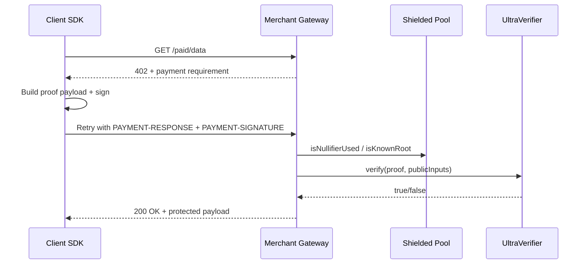

# Shielded x402 Architecture (MVP)

## Components

- `contracts/`: Shielded pool, verifier adapter interfaces, Solady-based safe ERC20 transfer handling.
- `circuits/spend_change/`: Noir circuit scaffold for single-note spend + change.
- `sdk/client/`: Deposit/proof payload generation, x402 retry client, note encryption.
- `sdk/merchant/`: Challenge issuing, payment verification, settlement records, withdrawal signing.
- `services/merchant-gateway/`: Express middleware enforcing shielded x402 payment.
- `packages/shared-types/`: Canonical crypto constants and payload schemas.
- `packages/erc8004-adapter/`: Feature-flagged ERC-8004 registry HTTP adapter.

## HTTP flow

1. Client calls paid endpoint without payment headers.
2. Merchant middleware returns `402` + `x-payment-requirement` challenge JSON.
3. Client builds shielded payment payload and signs it.
4. Client retries with `PAYMENT-RESPONSE`, `PAYMENT-SIGNATURE`, and `X-CHALLENGE-NONCE`.
5. Merchant validates nonce freshness, signature, and onchain proof/nullifier checks, then serves data.

## Feature flags

- `ENABLE_ERC8004=true` enables ERC-8004 adapter lookup endpoint behavior.
- `FIXED_CHALLENGE_NONCE` allows deterministic challenge issuance for live fixture-based E2E.

## Sequence

