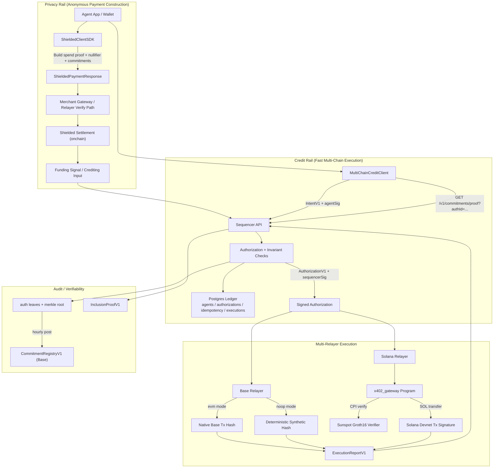

# x402 Multi-Chain Credit MVP (Protocol-Final)

## Model

1. Single sequencer is the real-time source of truth for balances/nonces.
2. Relayers are chain-bound executors (`eip155:8453`, `solana:devnet` for MVP).
3. Base commitments are delayed audit checkpoints and do not gate execution.

## Detailed Flow (Full)

## Frozen Domain Tags

1. `x402:intent:v1`
2. `x402:authorization:v1`
3. `x402:authleaf:v1`
4. `x402:execution-report:v1`

## Key Fields

- `AuthorizationV1.sequencerKeyId` (required)
- commitment metadata includes `sequencerKeyId`
- verification resolves key by `(sequencer_key_id -> public key)`

## Protocol Invariant

For each `agentId`:

1. accepted authorizations are strictly increasing in `agentNonce`
2. cumulative accepted debit never exceeds cumulative credited balance

Enforced in sequencer runtime, database transitions, and shared-type invariant checks.

## Status Machine

1. `ISSUED -> EXECUTED`
2. `ISSUED -> RECLAIMED`
3. `EXPIRED` is derived (`ISSUED && now > expiresAt`)

Terminal states: `EXECUTED`, `RECLAIMED`.

## Reclaim Rules (MVP)

Caller: `agent` or `sequencer`.

Preconditions:

1. `now > expiresAt`
2. status is `ISSUED`
3. one-time transition with `reclaimed_at`

## MerchantId Derivation

1. parse URL
2. require `https`
3. lowercase host
4. remove default port `443`
5. remove trailing slash except root `/`
6. strip query + fragment
7. hash: `SHA256(service_registry_id || normalized_url)`

## Commitments

- `authHash = H(authorization bytes)`
- `salt = H(sequencerSecret || authId)` (derived, not stored)
- `leaf = H(tag || logSeqNo || prevLeafHash || authHash || salt)`
- Base contract stores `(epochId, root, count, prevRoot, sequencerKeyId)`

## APIs

Sequencer:

- `POST /v1/admin/credit`
- `POST /v1/credit/authorize`
- `POST /v1/credit/executions`
- `POST /v1/credit/reclaim`
- `GET /v1/commitments/latest`
- `GET /v1/commitments/proof`

Relayer:

- `POST /v1/relay/pay`

## Signed Execution Reports

Relayers report execution using a signed envelope:

- `authId`
- `chainRef`
- `executionTxHash`
- `status`
- `reportId`
- `reportedAt`
- `relayerKeyId`
- `reportSig`

Sequencer verifies `reportSig` against `(chainRef, relayerKeyId)` in `relayer_keys`.
