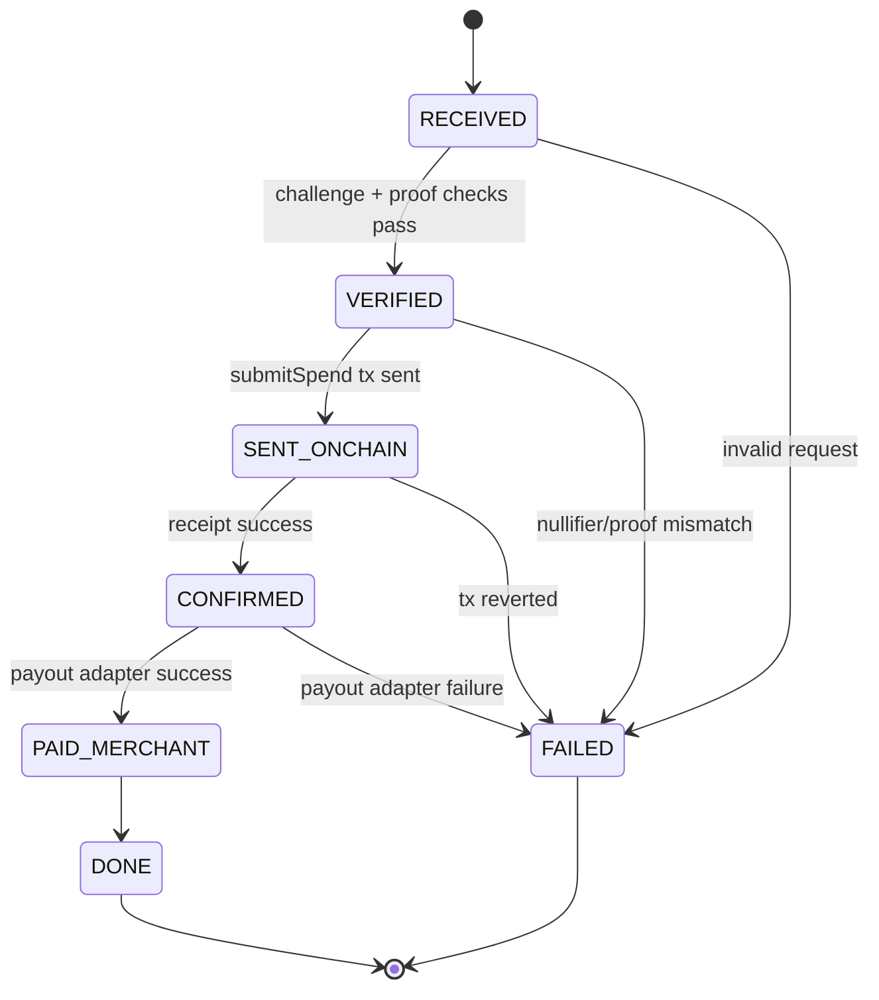

# Payment Relayer Architecture (No Merchant Change)

## Goal

Keep merchants on existing x402 behavior while allowing agents to pay privately:

1. agent proves locally
2. relayer verifies + settles onchain
3. relayer executes merchant payout adapter

## Request lifecycle

1. `RECEIVED`: relayer accepts `POST /v1/relay/pay`.
2. `VERIFIED`: relayer refetches merchant requirement and validates proof/challenge bindings.
3. `SENT_ONCHAIN`: relayer submits `ShieldedPool.submitSpend`.
4. `CONFIRMED`: settlement tx is confirmed.
5. `PAID_MERCHANT`: payout adapter call succeeds.
6. `DONE`: final state returned to agent.

Terminal failure state: `FAILED`.

## Lifecycle diagram

## Safeguards implemented

1. Challenge binding: relayer recomputes `challengeHash` from `(domain, nonce, amount, verifyingContract)` and compares against payload/public inputs.
2. Recipient binding: `verifyingContract` from challenge is part of hash binding.
3. Nullifier replay defense: relayer checks `isNullifierUsed`; pool enforces one-time nullifier onchain.
4. Root validity: relayer proof verifier checks known root + verifier contract validity.
5. Idempotency: deterministic key from request fields and payload; duplicate requests return existing settlement record.
6. Durable state: settlement records persisted to file store (`RELAYER_STORE_PATH`) with explicit state transitions.
7. Payout-after-confirm only: payout adapter runs only after successful onchain confirmation.
8. Auditability: status endpoint exposes settlement ID, tx hash, failure reason, merchant result metadata.

## Payout adapters

- `forward` mode: forwards merchant request with static configured headers (`RELAYER_PAYOUT_HEADERS_JSON`).
- `noop` mode: local/dev mode that simulates merchant payout success.
- `webhook` adapter helper exists for integrating external payment processors.

## Environment

- `RELAYER_PORT`
- `RELAYER_RPC_URL` (or `SEPOLIA_RPC_URL` fallback)
- `SHIELDED_POOL_ADDRESS`
- `ULTRA_VERIFIER_ADDRESS`
- `RELAYER_PRIVATE_KEY` (or `PAYMENT_RELAYER_PRIVATE_KEY` fallback)
- `RELAYER_STORE_PATH`
- `RELAYER_PAYOUT_MODE=forward|noop`
- `RELAYER_PAYOUT_HEADERS_JSON`

## Endpoints

- `GET /health`
- `POST /v1/relay/pay`
- `GET /v1/relay/status/:settlementId`
