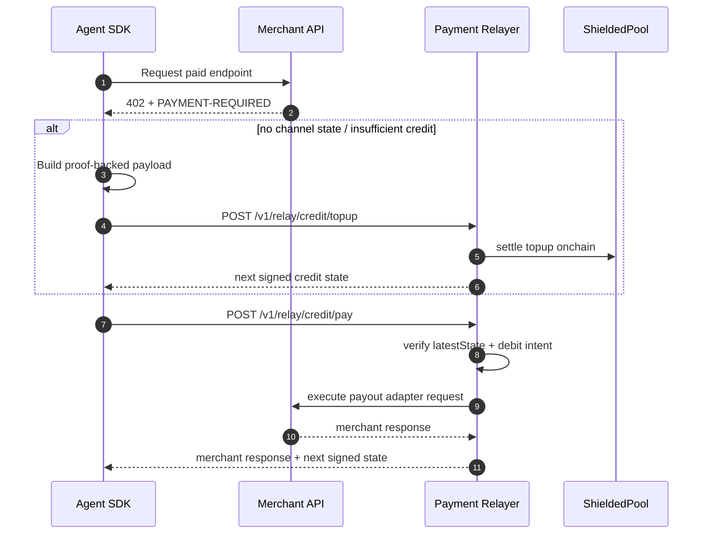

# x402 Wire Contract (Current)

This repository uses x402 framing for merchant challenges plus credit-relay settlement.

## Merchant Challenge Headers

- `PAYMENT-REQUIRED` on `402` response (base64 JSON envelope)
- `PAYMENT-SIGNATURE` for signed payment payload envelopes (used when constructing proof-backed payloads)

Header constants live in `@shielded-x402/shared-types` (`X402_HEADERS`).

## `PAYMENT-REQUIRED` envelope

```json
{
  "x402Version": 2,
  "accepts": [
    {
      "x402Version": 2,
      "scheme": "exact",
      "network": "eip155:84532",
      "asset": "0x...",
      "payTo": "0x...",
      "rail": "shielded-usdc",
      "amount": "10000",
      "challengeNonce": "0x...",
      "challengeExpiry": "1735689600",
      "merchantPubKey": "0x...",
      "verifyingContract": "0x..."
    }
  ]
}
```

## Credit Relay Requests

### Topup

`POST /v1/relay/credit/topup`

```json
{
  "channelId": "0x...",
  "requestId": "credit-topup-...",
  "paymentPayload": { "proof": "0x...", "publicInputs": ["0x..."], "...": "..." },
  "paymentPayloadSignature": "0x...",
  "latestState": { "state": { "...": "..." }, "agentSignature": "0x...", "relayerSignature": "0x..." }
}
```

### Debit

`POST /v1/relay/credit/pay`

```json
{
  "requestId": "credit-...",
  "merchantRequest": {
    "url": "https://merchant.example/paid",
    "method": "GET",
    "headers": { "accept": "application/json" }
  },
  "requirement": { "...": "normalized requirement" },
  "latestState": { "state": { "...": "..." }, "agentSignature": "0x...", "relayerSignature": "0x..." },
  "debitIntent": {
    "channelId": "0x...",
    "prevStateHash": "0x...",
    "nextSeq": "6",
    "amount": "10000",
    "merchantRequestHash": "0x...",
    "deadline": "1735689700",
    "requestId": "credit-..."
  },
  "debitIntentSignature": "0x..."
}
```

## Flow Diagram



## Notes

- Credit lane is sequential per channel (`nextSeq = currentSeq + 1`).
- `requestId` is mandatory for idempotency.
- Replay protection is enforced through state hash, seq, deadline, and canonical merchant request hash.
