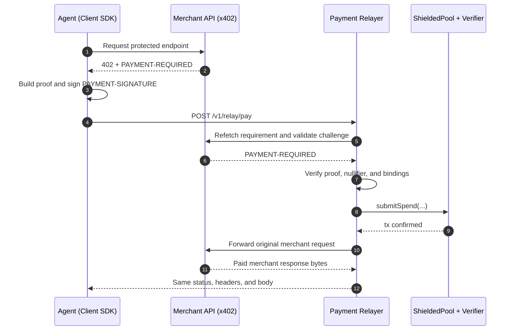

# x402 Wire Contract (Shielded Rail)

This repo now uses strict x402 v2-style framing:

- `PAYMENT-REQUIRED` on `402` responses (base64 JSON envelope)
- `PAYMENT-SIGNATURE` on retry requests (base64 JSON envelope)
- `PAYMENT-RESPONSE` is reserved for response settlement metadata

## `PAYMENT-REQUIRED` envelope

```json
{
  "x402Version": 2,
  "accepts": [
    {
      "x402Version": 2,
      "scheme": "exact",
      "network": "eip155:11155111",
      "asset": "0x...",
      "payTo": "0x...",
      "rail": "shielded-usdc",
      "amount": "1000000",
      "challengeNonce": "0x...",
      "challengeExpiry": "<unix-ms>",
      "merchantPubKey": "0x...",
      "verifyingContract": "0x...",
      "extra": {
        "rail": "shielded-usdc",
        "challengeNonce": "0x...",
        "challengeExpiry": "<unix-ms>",
        "merchantPubKey": "0x...",
        "verifyingContract": "0x..."
      }
    }
  ]
}
```

## `PAYMENT-SIGNATURE` envelope

```json
{
  "x402Version": 2,
  "accepted": { "...": "selected accepted requirement" },
  "challengeNonce": "0x...",
  "signature": "0x...",
  "payload": {
    "proof": "0x...",
    "publicInputs": ["0x...", "0x...", "0x...", "0x...", "0x...", "0x..."],
    "nullifier": "0x...",
    "root": "0x...",
    "merchantCommitment": "0x...",
    "changeCommitment": "0x...",
    "challengeHash": "0x...",
    "encryptedReceipt": "0x...",
    "txHint": "leaf:<index>"
  }
}
```

## End-to-End Flow (Shielded Rail)



## Relayer Bridge Endpoint

For existing non-shielded x402 merchants, client relayed mode uses:

- `POST /v1/relay/challenge`

Request:

- merchant request metadata + original merchant `PAYMENT-REQUIRED` header

Response:

- shielded `PaymentRequirement` (`rail=shielded-usdc`) and corresponding `PAYMENT-REQUIRED` header

This lets agents pay standard x402 merchants through shielded settlement without merchant-side code changes.
